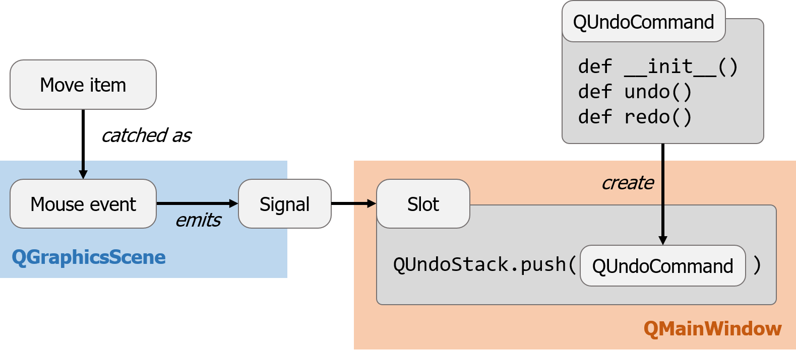

# Undo framework example in PyQt
This is the [undo framework example](http://doc.qt.io/qt-5/qtwidgets-tools-undoframework-example.html)
ported in Python with PyQt.

## Requirements
- [PyQt](https://riverbankcomputing.com/software/pyqt/intro) : Qt functionality in Python.
- [QtPy](https://github.com/spyder-ide/qtpy) : Abstraction for different versions of PyQt and PySide.

```
pip install qtpy  # install by pypi
```

&nbsp;&nbsp;&nbsp;or

```
conda install qtpy  # install by conda environment
```

## Usage
```
cd pyqtex/undo_framework_example
python app.py
```

## Diagram
This diagram shows how *move item event* is finally connected to [`QUndoCommand`](http://doc.qt.io/qt-5/qundocommand.html)
and [`QUndoStack`](http://doc.qt.io/qt-5/qundostack.html).



Users need to implement undo/redo behaviors for each command.
Users, however, do not need to implement the stack operations,
which are handled by `QUndoStack` object.
The only necessary code for utilizing `QUndoStack` is the creation of `QAction`
using `QUndoStack`, rather than directly calling QAction as follows.

```
# For example,
self.undoAction = self.undoStack.createUndoAction(self, "&Undo")
self.redoAction = self.undoStack.createRedoAction(self, "&Redo")
```
